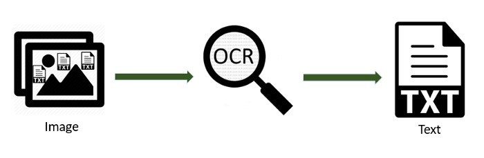
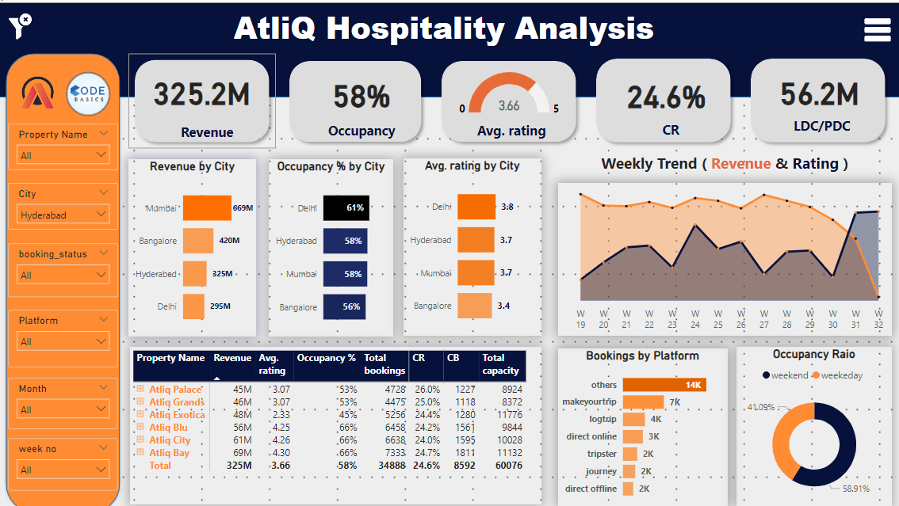
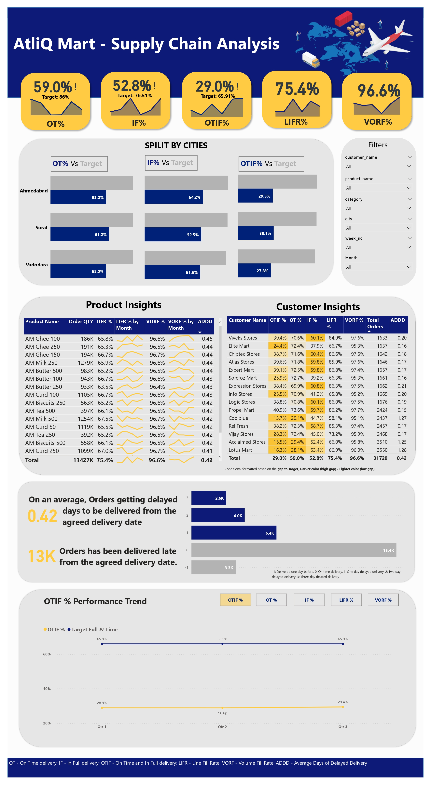
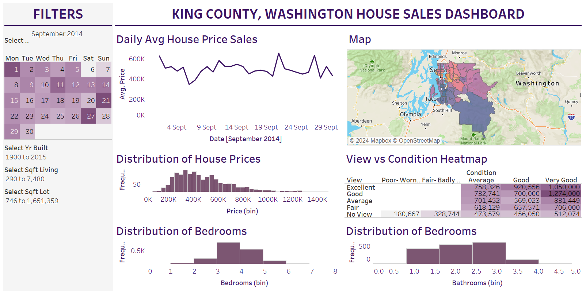
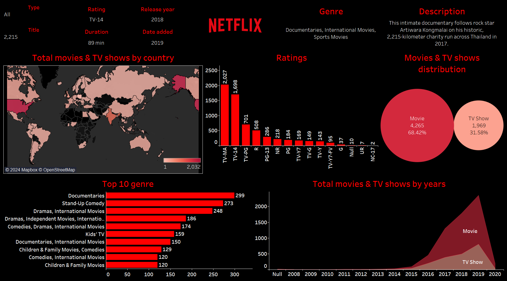

# Data Analyst

#### Technical Skills: Power BI, Tableau, SAP BobJ, QlikSense, ETL, MySQL, Microsoft Excel, Microsoft Fabric, Python

## Education
- MBA, Data Science | Amity University (_Aug 2023_)								       		
- B.Tech, Computer Science | MIT Academy of Engineering (_July 2023_)	 			        		

## Work Experience
**Data Analyst Associate @ Celebal Technologies (_Feb 2023 - Present_)**
- Developed and validated Power BI reports, guaranteeing data accuracy and reliability, and facilitating informed decision-making for
improved procurement strategies.
- EvaluatedBI reports using DAXStudio and Power BI tools, validating complex calculations while optimizing interactivity for swift data
retrieval and accuracy in alignment with business logic.
- Conducted meticulous QlikSense column mapping for data consistency across reports, later leveraging this expertise in Power BI for
complex modelling during migration.
- Contributed to QlikSense to Power BI migration, employing decomposition skills for accurate data mapping and efficient report generation.

**Data Science Intern @ Celebal Technologies (_Aug 2022 - Sep 2022_)**
- Skilled at troubleshooting and root cause analysis, as well as effectively utilizing Azure Data Factory and cross-functional cooperation to
optimize data pipelines and ensure scalable and economical ETL processes.
- Worked on several Kaggle data sets to conduct exploratory data analysis (EDA) and Data visualization.

**Data Science Intern @ Critical AI Pvt Ltd (_Jun 2022 - Jul 2022_)**
- Incorporated Python libraries such as NumPy and Pandas into ETL procedures, applying Data Science concepts and Machine
Learning methods to design and implement reliable solutions.
- Adept in using those libraries in conjunction with data structures to perform effective data translation and manipulation,
guaranteeing superior results.

## Projects
### Automatic Handwritten Devanagari Text Recognition using OCR
[Link](https://github.com/Tanisha-27505/Automatic-Text-Recognition)

The automated Devanagari text recognition using the OCR(Optical Character Recognition) platform consists of handwritten Devanagari text recognition, pdf segmentation, feature extraction with multiple algorithms, and picture categorization using different algorithms to get the most accurate outcome.

### Hospitality Analysis
[Link](https://github.com/Tanisha-27505/Hospitality-Analysis)

Constructed a Power BI dashboard with insights to examine sales information spanning three months for several AtliQ hotels located in four distinct cities.

### Supply Chain Analysis
[Link](https://github.com/Tanisha-27505/Supply-Chain-Analysis)

Performed Data Analysis and constructed a Power BI Dashboard which generates insights to solve a Supply Chain Issue in the FMCG domain.

### King County House Sales Analysis
[Link](https://github.com/Tanisha-27505/King-County-House-Sales-Dashboard)

Explored several aspects of house sales in the King County area, such as pricing patterns, property attributes, and geographic distribution, with an interactive map that visualizes insights about the county using Tableau.

### Netflix Analysis
[Link](https://github.com/Tanisha-27505/Netflix-Data-Analysis)

Netflix Movies & TV Shows Detailed Analysis Using Tableau

## Skills & Organizations
- Data Science:
            • Python Fundamentals
						• Scikit-Learn
		        •	Numpy
		        •	Matplotlib
		        •	Pandas
		        •	Seaborn
            • Statistics
		        •	NLTK
- Software Tools:
						•	Tableau
            •	Microsoft Excel
		        •	Power BI
		        •	SSMS
            •	Jupyter Notebook
		        •	SAP BobJ
            •	QlikSense
- Certifications:
						•	Microsoft Certified: Azure Data Fundamentals(DP-900)
		        •	Microsoft Certified: Power BI Data Analyst(PL-300)
		        •	Google Data Analytics Professional Certificate
- Activities:
						•	Participated in the 'Women In Technology' session arranged by NASSCOM at Infosys, India
		        •	Participated in Project Expo 2022
		        •	News and Media Team Leader in MITAOE Student Council
		        •	Content Writer in E-Cell during FY
		        •	Participated in Datathon 2022
            •	Participated in Smart India Hackathon 2022

## Get In Touch
- Mail:
            •	tanishanazare@gmail.com
            •	ttnazare@mitaoe.ac.in
- Phone:
            •	9011916680
- Social:
            •	GitHub: https://github.com/Tanisha-27505
            •	Instagram: https://www.instagram.com/_tanisha275_/
  			    •	LinkedIn: https://www.linkedin.com/in/tanisha-nazare/
											
										
